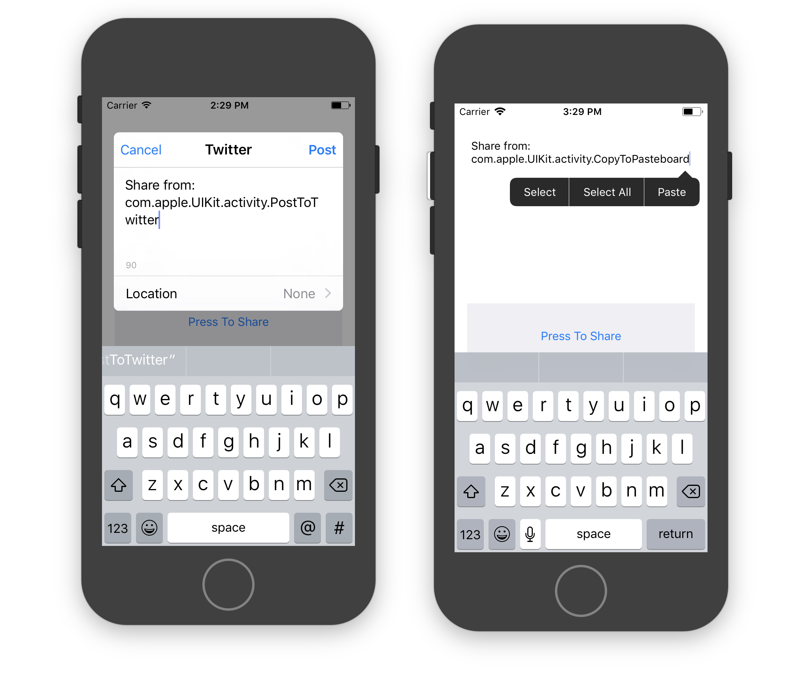

This simple project shows how we can make our UIViewController the "item provider" for a share controller - and thus add the sharing activitys ID into the share message.

It's just a show from this Twitter discussion: https://twitter.com/viticci/status/950886902152007680

